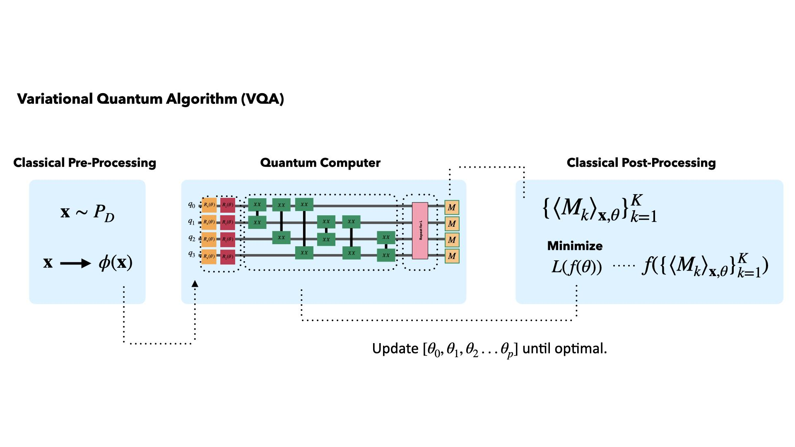

# PAntza (Pulse-based ANsaTZ for variational Algorithms)

This repository contains the code and materials associated with the undergraduate thesis in Physics at the University of Milano Bicocca by the student Riccardo Marega. The uploaded code will be mainly organized within the folders `notebooks` and `scripts`. The first of these will contain a limited number of Jupyter notebooks, representative of the student's current knowledge. The second will instead contain Python scripts containing code snippets belonging to programs potentially loaded in the `notebooks` folder.

## Qiskit and PulsedVQE

PulsedVQE is implemented using [Qiskit](https://qiskit.org/), an open-source software development library for IBM quantum computers. Qiskit provides the necessary tools to design, simulate, and run quantum algorithms on real quantum computers or simulators.

For further details on PulsedVQE, refer to the following articles and resources:
- [Reference on PulsedVQE executed through Qiskit](https://medium.com/qiskit/enhance-variational-quantum-algorithms-with-qiskit-pulse-and-qiskit-dynamics-768249daf8dd)
- [Qiskit Documentation](https://qiskit.org/documentation/)

## VQA (Variational Quantum Algorithms)

1. Variational Form: VQA uses a variational quantum circuit, also known as a variational form or ansatz, to encode a parameterized quantum state. The parameters in the circuit are adjusted during the optimization process to minimize a cost function.

2. Quantum Measurement: After preparing the variational state, the quantum computer performs measurements to extract information about the quantum state. These measurements are used to calculate the cost function.

3. Classical Optimization: The classical part of the algorithm is responsible for optimizing the parameters of the variational form. It iteratively adjusts the parameters to minimize the cost function, typically using classical optimization algorithms.

4. Repetition and Iteration: Steps 1 to 3 are repeated until the algorithm converges to a solution that minimizes the cost function. The resulting parameters encode the solution to the optimization problem.

Credit: https://www.physics.ox.ac.uk/

## Thesis

- Anyone with this link can edit this project: https://it.overleaf.com/7592676962gqjxrcwkqxhw#3f4030
- Anyone with this link can view this project: https://it.overleaf.com/read/xhqqkywdzgrb#0d12b7

## Contents

- `scripts/`: Contains the main source files and text files with some notes from the student.
- `graphs/`: Contains some necessary graphs as reflections to deepen theoretical foundations.
- `notebooks/`: Jupyter notebooks for data analysis or experiments.
- `librerie.txt`: The following file lists all the libraries installed in the virtual environment where the codes are compiled.
- `LICENSE`: Project license.
- `README.md`: This README file.

**Student:** [Riccardo Marega]
**Institution:** [University of Milano Bicocca]
**Study Course:** [Undergraduate degree in Physics]
**Academic Year:** [2023/2024]

  
